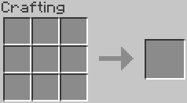

# Einleitung
Die Domain "http://minecraft-item-resolver.mc" basiert auf den Rezepten und Gegenständen (Items, bzw. Blocks) aus dem Videospiel [Minecraft](https://www.minecraft.net/de-de/).
Minecraft ist ein survival Spiel in welchem das Crafting, also das Herstellen von Gegenständen, mithilfe eines 3x3 Feldes, in das die Zutaten gelegt werden können, erfolgt.



Hierbei wird zwischen zwei Arten von Rezepten unterschieden. Es gibt die sogenannten "Shapeful Recipes" und "Shapeless Recipes". Der Unterschied zwischen den beiden Rezeptarten ist
die anordnung der Gegenstände im Crafting-Bereich. Shapeful Recipes fordern eine bestimmte Anordnung der Gegenstände um einen neune Gegenstand herzustellen.
Shapeless Recipes hingegen fordern keine bestimmte Anordnung.

### Beispiel Shapeful Recipes


Das Bild zeigt das Rezept zur Herstellung eines Bettes, für das 3x Holz und 3x Wolle benötigt werden. Die Wolle muss zwingendermaßen über den Holz plaziert werden,
da das Rezept dies fordert.

### Beispiel Shapeless Recipes
Es gibt nur wenige Shapeless Recipes in Minecraft, eins davon ist "Pilzsuppe":


Es spielt bei Shapeless Recipes keine Rolle, wo sich ein Gegenstand im Crafting-Bereich befinden. Das bedeutet, dass sowohl die Pilze als auch die Suppenschüssel in jedem Platz liegen könnten, das Ergebnis ist immer das gleiche.

### Ausgabemenge
In beiden Beispielen erhält der Spieler nur einen neuen Gegenstand, es gibt jedoch Rezepte, durch welche der Spieler mehr als einen Gegenstand erhält. Legt man beispielsweise einen Eisenbarren in den Crafting-Bereich, so erhält man 9 Eisennuggets. 
Diese Ausgabemenge wird in der Domain als "outputAmount" angegeben. 

### Minecraft-Wiki Parser:
Die Grundlegenden Informationen sowie die Rezepte der Gegensände wurden mithilfe eines selbst entwickelten Parsers automatisch generiert. Daher gibt es eine hohe Anzahl an Tripeln. 
Der Parser ist im öffentlichen Github Repository https://github.com/lage2104/minecraft-wiki-parser einsehbar.
Als Quelle verwendet der Parser die [Minecraft Wiki](https://minecraft.gamepedia.com/Minecraft_Wiki). Informationen zur Einrichtung und Verwendung befinden sich am Ende des Dokuments.


### Weitere Herstellungsmöglichkeiten
Der Wiki-Parser extrahiert lediglich die Rezepte für den 3x3 Crafting-Bereich. Es gibt jedoch noch etliche andere Wege bestimmte Gegenstände herzustellen. Eine möglichkeit ist das Einschmelzen von beispielsweise Eisenadern. 
Hierfür gibt es einen Ofen, welcher nur einen Platz für ein Eingabegegenstand hat, dieser wird dann mithilfe von beispielsweise Kohle oder einem anderen brennbaren Stoff eingeschmolzen und man erhält Eisenbarren. 
Dieser Prozess wird in der Domain auch dargestellt und wie jedes andere Rezept behandelt. Dabei wird die Unterklasse "smeltingRecipe" verwendet. Das Smelting Recipe wurde für folgende Gegensände hinzugefügt:
  * mc:iron_ingot
  * mc:gold_ingot

### Bezug zu echten Gegenständen
Die Property "realWorldObject" enthält eine Verlinkung zu einem Artikel in der DBPedia, der den realen Gegenstand darstellt. Auch diese Information kann der Wiki-Parser nicht extrahieren, jedoch wurde sie für foglende Gegensände manuell ergänzt:
  * mc:iron_ingot
  * mc:gold_ingot
  * mc:diamond
  * mc:oak_log
  * mc:cauldron
  * mc:lapis_lazuli
  * mc:dirt
  * mc:map
  * mc:minecart 


# Anfragen

## Anfrage 1 - allItems
Ermittelt alle verfügbaren Items innerhalb des Triple Stores

## Anfrage 2 - oneItem
Ermittlet Informationen zu einem, in der BIND-Funktion angegebenen, Item.

## Anfrage 3 - recipe
Ermittelt alle Rezeptbestandteile auf erster Ebene eines Items.

### Variante a
Alle Informationen werden unformatiert ausgegeben.

### Variante b
#### Teil a
Ermittelt Metadaten zu einem Item (Rezepttyp, Ausgabemenge)
#### Teil b
Stellt ausschließlich Informationen zu den Rezeptbestandteilen auf erster Ebene dar.

### Variante c
Mithilfe von zwei Subqueries (Kombination von Variante ba und bb) zur "formatierten" Darstellung.

## Anfrage 4 - item occurrences
Ermittelt die Anzahl der Vorkommen eines Items in allen Rezepten. Mehrfache Aufkommen eines Items innerhalb eines Rezeptes werden (absichtlich) nicht gezählt. 

## Anfrage 5 - craftableItems
### Variante a
Ermittelt alle Items in deren Rezept das angegebene Item in erster Ebene vorkommt.
### Variante b
Ermittelt alle Items in deren Rezept das angegebene Item ab der ersten Ebene vorkommt.

## Anfrage 6 - essential elements
Ermittelt alle Items die für die Umsetzung eines Rezeptes notwendig sind. Für jedes Element aus einem Rezept wird wiederrum das Rezept ermittelt. 

Im Beispiel "mc:bookshelf" ist das Ergebnis:
* mc:oak_log
* mc:sugar_cane
* mc:rabbit_hide

**oak_log** wird benötigt um oak_planks herzustellen, die im Rezept für bookshelfs vorkommen.
**sugar_cane** wird benötigt um Papier(mc:paper) hezustellen, das benötigt wird um Bücher herszustellen, die im Rezept für bookshelfs vorkommen.
**rabbit_hide** wird benötigt um Leder(mc:leather) herszustellen, das benötigt wird um Bücher herzustellen, die im Rezept für bookshelfs vorkommen.


# Installation Wiki-Parser

1. Beautifulsoup für Python installieren
```
pip install beautifulsoup4
```
2. Requests für Python installieren
```
pip install requests
```
3. lxml für Python installieren
```
pip install lxml
```
4. Fetches all item information from https://minecraft.gamepedia.com/Minecraft_Wiki and stores it locally. Stores data.json with parsed information.
```
python3 parser.py --init
```
5. Create ontology ttl file from data.json. Static information from header.ttl and addidtional.ttl are included. 
```
python3 ontology.py
```